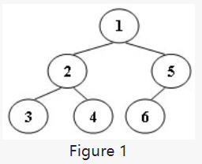

根据输入时的前序、中序的顺序，后序输出树  
https://pintia.cn/problem-sets/1077214780527620096/problems/1106167947099181058


<!-- more -->
## Tree Traversals Again
An inorder binary tree traversal can be implemented in a non-recursive way with a stack. For example, suppose that when a 6-node binary tree (with the keys numbered from 1 to 6) is traversed, the stack operations are: push(1); push(2); push(3); pop(); pop(); push(4); pop(); pop(); push(5); push(6); pop(); pop(). Then a unique binary tree (shown in Figure 1) can be generated from this sequence of operations. Your task is to give the postorder traversal sequence of this tree.



Input Specification:
Each input file contains one test case. For each case, the first line contains a positive integer N (≤30) which is the total number of nodes in a tree (and hence the nodes are numbered from 1 to N). Then 2N lines follow, each describes a stack operation in the format: "Push X" where X is the index of the node being pushed onto the stack; or "Pop" meaning to pop one node from the stack.

Output Specification:
For each test case, print the postorder traversal sequence of the corresponding tree in one line. A solution is guaranteed to exist. All the numbers must be separated by exactly one space, and there must be no extra space at the end of the line.

```
Sample Input:  
6  
Push 1  
Push 2  
Push 3  
Pop  
Pop  
Push 4  
Pop  
Pop  
Push 5  
Push 6  
Pop  
Pop  
```
```
Sample Output:
3 4 2 6 5 1
```


## 分析

非常令人沮丧的是这道题在理解了题目意思,并思路清晰并确定没毛病后，并不能正确地敲出代码。  
我的思路大致是：得到先序遍历序列、中序遍历序列，建立树，后序输出树。 

理解题意参考了以下博客：
https://blog.csdn.net/m0_37698652/article/details/79218014  
https://www.jianshu.com/p/18cff70b673d  
https://www.cnblogs.com/keelongz/p/10046503.html  
https://www.cnblogs.com/claremore/p/4806304.html

## 代码
```C++
#include<iostream>
#include<stack>
#include<string.h>
using namespace std;
#define MAX 101
typedef struct TNode
{
    int data;
    struct TNode *left;
    struct TNode *right;
    
}TNode;

int pre[MAX]={0};
int middle[MAX]={0};

int ps,pe,ms,me;

int total=0;
int count=0;

TNode* CreateTree(int ps,int pe,int ms,int me)
{
    int i;
    if(ps>pe)
        return NULL;
    
    //查找根节点在中序序列中位置 
    for( i=ms;i<=me;i++)
    {
        if(middle[i]==pre[ps])
            break;
    }
    TNode *r = new TNode;
    
    //若第i个位置为根节点，则i-起始位置=左子树个数
    int num1=i-ms;
    r->data=pre[ps];
     //左子树对应：先序序列：根节点往后一个~根节点+左子树个数
     //                中序序列：起始位置（中序：左根右）~根节点位置（即i） 
    r->left=CreateTree(ps+1,ps+num1,ms,i-1);
    //右子树对应：先序序列：左子树位置+1~ 列尾 
     //                中序序列：根节点+1~列尾 
    r->right=CreateTree(ps+num1+1,pe,i+1,me); 
    return r;
}

 //后序遍历输出 
void PostOrder(TNode *r)
{
    
    if(r==NULL)
        return;
    PostOrder(r->left);
    PostOrder(r->right);
    printf("%d",r->data);
    count++;
    if(count <total)
        printf(" ");
    
}

int main(void)
{
    scanf("%d",&total);
  std::stack<int> a;
    int tmp;
    char tmps[20];
    int pn=0; //前序序列下标
    int mn=0; //中序序列下标 
    for(int i=0;i<2*total;i++)
    {
        scanf("%s",tmps);
        if(strcmp(tmps,"Push")==0)
        {
            scanf("%d",&tmp);
            pre[pn]=tmp;
            pn++;
            a.push(tmp);
        }
        else
        {
            middle[mn]=a.top();
            mn++;
            a.pop();
        }
    }
    TNode* root = CreateTree(0, total-1, 0, total-1);
    PostOrder(root);
    return 0;
    
}
```