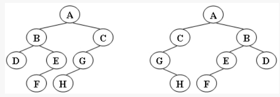
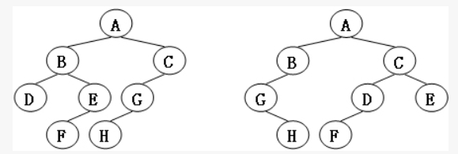

https://pintia.cn/problem-sets/1077214780527620096/problems/1106167947099181056

<!-- more -->
### 树的同构

给定两棵树T1和T2。如果T1可以通过若干次左右孩子互换就变成T2，则我们称两棵树是“同构”的。例如图1给出的两棵树就是同构的，因为我们把其中一棵树的结点A、B、G的左右孩子互换后，就得到另外一棵树。而图2就不是同构的。
图1
图2

现给定两棵树，请你判断它们是否是同构的。
输入格式:
输入给出2棵二叉树树的信息。对于每棵树，首先在一行中给出一个非负整数N (≤10)，即该树的结点数（此时假设结点从0到N−1编号）；随后N行，第i行对应编号第i个结点，给出该结点中存储的1个英文大写字母、其左孩子结点的编号、右孩子结点的编号。如果孩子结点为空，则在相应位置上给出“-”。给出的数据间用一个空格分隔。注意：题目保证每个结点中存储的字母是不同的。

输出格式:
如果两棵树是同构的，输出“Yes”，否则输出“No”。  
```
输入样例1（对应图1）：
8
A 1 2
B 3 4
C 5 -
D - -
E 6 -
G 7 -
F - -
H - -
8
G - 4
B 7 6
F - -
A 5 1
H - -
C 0 -
D - -
E 2 -
```
```
输出样例1:
Yes
```
```
输入样例2（对应图2）：
8
B 5 7
F - -
A 0 3
C 6 -
H - -
D - -
G 4 -
E 1 -
8
D 6 -
B 5 -
E - -
H - -
C 0 2
G - 3
F - -
A 1 4
```
```
输出样例2:
No
```

---

建立两棵二叉树，递归判断其是否同构  
同样，浙大数据结构小白专场部分关键点讲的很清楚了，主要注意构建树和判断同构时的条件不要漏掉。  
！！以及，注意下left right不要写恍了写错了，不要问为什么。  
注释详见代码

### 代码
```C
#include<stdio.h>
#include<stdlib.h>

#define MaxTree 10
#define ElementType char
#define Tree int

struct TreeNode {
    ElementType Element;
    Tree Left;
    Tree Right;
}T1[MaxTree], T2[MaxTree];

Tree BuildTree (struct TreeNode T[]) {
    int num;
    int check[MaxTree];   //判断该节点有没有被别人指向，从而找出根节点
    int i;
    char cl, cr;
    Tree Root = -1;     //刚开始将节点置空，空树就返回-1

    if(scanf("%d", &num)){
    };
    if(num) {   //如果不为空树
        for (i = 0; i < num; i++)
            check[i] = 0;   //默认大家都没有被指向，置零
        for (i = 0; i < num; i++) {
            //！！！ATTETION！！！，换行符放在最前，不然录入的第一个T[i].element会是‘\n’，并且刚好最后不能有换行符
            if(scanf("\n%c %c %c", &T[i].Element, &cl, &cr)){
            };
            // printf("print:%c %c %c\n",T[i].Element, cl, cr);
            //左
            if(cl != '-') {
                T[i].Left = cl-'0';   //char型转为int型
                //第T[i].left的节点，是当前第T[i]节点的左节点
                check[T[i].Left] = 1;
            }
            else
                T[i].Left = -1;
            //右
            if(cr != '-') {
                T[i].Right = cr-'0';   //char型转为int型
                //第T[i].left的节点，是当前第T[i]节点的左节点
                check[T[i].Right] = 1;
            }
            else
                T[i].Right = -1;
        }
        //找出根节点
        for (i = 0; i < num; i++)
            if(!check[i])
                break;
        Root = i;
    }
    return Root;
}

int Isomorphic (Tree R1, Tree R2){
    //两个树都为空
    if((R1 == -1) && (R2 == -1))
        return 1;
    //有一棵树为空
    if(((R1 == -1) && (R2 != -1)) || ((R1 != -1) && (R2 == -1)))
        return 0;
    //根节点不同
    if((T1[R1].Element) != (T2[R2].Element))
        return 0;
    /*如果左儿子都为空判断右儿子是否同构：主要看以下三个方面
    （1）右儿子是否都为空
    （2）是否一个有右儿子一个没有
    （3）右儿子数据是否相同
    */
    //都没有左子树
    if((T1[R1].Left == -1) && (T2[R2].Left == -1))
        return Isomorphic(T1[R1].Right, T2[R2].Right);

    //左子树非空且左边的节点值相等（直接继续判断左边是否同构
    if( (T1[R1].Left != -1) && 
        (T2[R2].Left != -1) &&      //靠，这里一开始达成了right，找了好久才发现
        ((T1[T1[R1].Left].Element) == (T2[T2[R2].Left].Element)))
        return (Isomorphic(T1[R1].Right, T2[R2].Right) &&
                Isomorphic(T1[R1].Left, T2[R2].Left));
    //左子树非空且左边的节点值不相等（swap，可能左跟右同构
    else 
        return (Isomorphic(T1[R1].Right, T2[R2].Left) &&
                Isomorphic(T1[R1].Left, T2[R2].Right));


}

int main() {
    //构建二叉树
    Tree R1, R2;
    R1 = BuildTree(T1);
    R2 = BuildTree(T2);

    if(Isomorphic(R1, R2))
        printf("Yes\n");
    else
        printf("No\n");

    getchar();
    return 0;
}


```